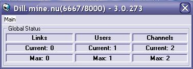

<div align="center">

## AGAIN UPDATED: PURE IRCd, fully Networkable, great conf file\.


</div>

### Description

UPDATE:

-Services not inbuilt anymore, there's a "Services Server" i made at:

http://www.pscode.com/vb/scripts/ShowCode.asp?txtCodeId=40066&lngWId=1 (slow)

OR

http://dillerthekiller.free.fr/pure

-Better NetSplit resolving

-Compiling as P-Code now, .exe and Native Code will crash on Netsplits for some reason.

-Service System is actually almost perfect.

This is a fully networkable IRC server. It is able to do everything apart from /whowas, which seems impossible to make. i have included a picture that shows a working network. i havent experienced any trouble on this. But netsplits are still a pain, and they need to be resolved by operators because often there will be gohsts remaining, ill find a solution to that as soon as possible.

CHANGES:

-Improved logging features, can be turned off and on now, also implemented an status file, which will be generated any ### seconds, customizable through .conf

-using API-less solution now, to read the settings files.

-fixed the whitespace in nicklist bug.

Alright i have forgotten to choose a caterogy and ill do everything but writing this whole bit again, ive made an readme.txt with much better information anyway.
 
### More Info
 
Knowledge of IRC (a bit at least), should have mIRC or be able to use another client.

READ THE README FILE.


<span>             |<span>
---                |---
**Submitted On**   |2002-10-22 15:57:16
**By**             |[Dennis Fisch](https://github.com/Planet-Source-Code/PSCIndex/blob/master/ByAuthor/dennis-fisch.md)
**Level**          |Advanced
**User Rating**    |5.0 (25 globes from 5 users)
**Compatibility**  |VB 6\.0
**Category**       |[Internet/ HTML](https://github.com/Planet-Source-Code/PSCIndex/blob/master/ByCategory/internet-html__1-34.md)
**World**          |[Visual Basic](https://github.com/Planet-Source-Code/PSCIndex/blob/master/ByWorld/visual-basic.md)
**Archive File**   |[AGAIN\_UPDA14855710222002\.zip](https://github.com/Planet-Source-Code/dennis-fisch-again-updated-pure-ircd-fully-networkable-great-conf-file__1-39866/archive/master.zip)

### API Declarations

```
Private Declare Function WSAStartup Lib "wsock32" (ByVal VersionReq As Long, WSADataReturn As WSADATA) As Long
Private Declare Function WSACleanup Lib "wsock32" () As Long
Private Declare Function WSAGetLastError Lib "wsock32" () As Long
Private Declare Function gethostbyaddr Lib "wsock32" (addr As Long, addrLen As Long, addrType As Long) As Long
Private Declare Function gethostbyname Lib "wsock32" (ByVal hostname As String) As Long
Private Declare Sub RtlMoveMemory Lib "kernel32" (hpvDest As Any, ByVal hpvSource As Long, ByVal cbCopy As Long)
Private Declare Sub Sleep Lib "kernel32" (ByVal dwMilliseconds As Long)
Private Declare Function GetTickCount& Lib "kernel32" ()
Private Declare Function CoCreateGuid Lib "ole32" (ID As Any) As Long
Public Declare Function WritePrivateProfileString Lib "kernel32" Alias "WritePrivateProfileStringA" (ByVal lpApplicationName As String, ByVal lpKeyName As Any, ByVal lpString As Any, ByVal lpFileName As String) As Long
Public Declare Function GetPrivateProfileString Lib "kernel32" Alias "GetPrivateProfileStringA" (ByVal lpApplicationName As String, ByVal lpKeyName As Any, ByVal lpDefault As String, ByVal lpReturnedString As String, ByVal nSize As Long, ByVal lpFileName As String) As Long
Private Declare Function Shell_NotifyIcon Lib "shell32" Alias "Shell_NotifyIconA" (ByVal dwMessage As Long, pnid As NOTIFYICONDATA) As Boolean
```


